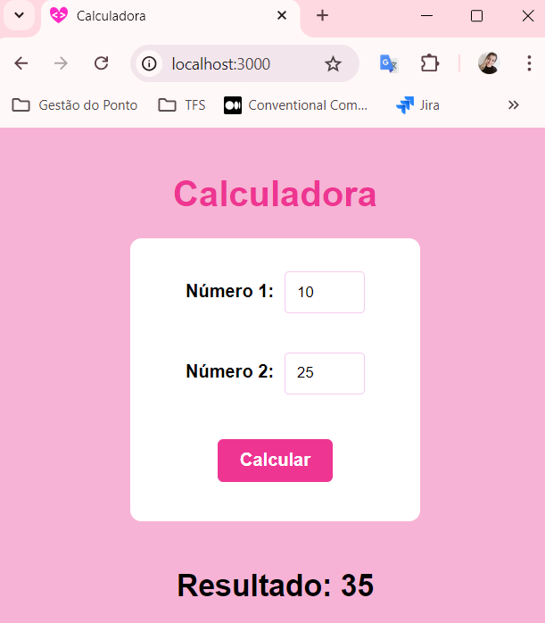

<h1  align="center"> Aula Prática Desenvolvimento com React</h1>

 

## Descrição do Projeto

Mini projeto desenvolvido para a disciplina de `Desenvolvimento com React`.

  

## Demonstração da Aplicação

 

 
 

https://github.com/user-attachments/assets/8c90e0d5-0a47-4567-9d27-e8629a93a218

 

## Tecnologias Utilizadas
- `React`
- `HTML`
- `JavaScript`
- `CSS`
- `Next.js`

 

## Autoria do Projeto

| [ Daniele Tavares Lobo](https://github.com/danitavareslobo) |
| :----: |